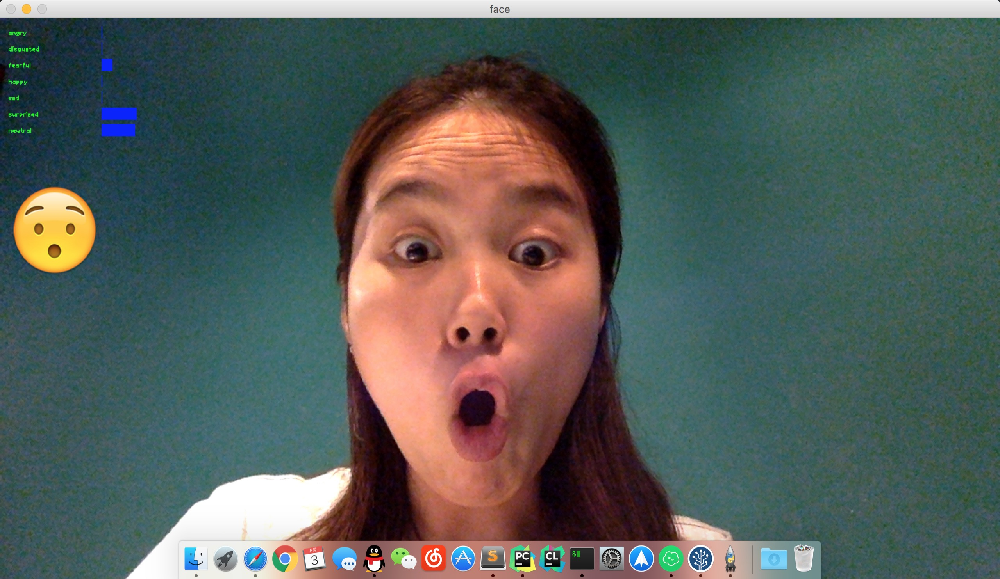

Opensource deep learning framework [TensorFlow](https://www.tensorflow.org) is used in **Facial Expression Recognition(FER)**. 
The trained models achieved 65% accuracy in fer2013. If you like this, please give me a star.

#### Dependencies

FER requires:
- Python (>= 3.3)
- TensorFlow (>= 1.1.0)[install](https://www.tensorflow.org/install/)
- OpenCV (python3-version)[install](http://docs.opencv.org/master/da/df6/tutorial_py_table_of_contents_setup.html)

Only tested in Ubuntu and macOS Sierra. Other platforms are not sure work well. When problems meet, open an issue, I'll do my best to solve that.

#### Usage
###### demo
You will have to download the pre-trained models [here](http://pan.baidu.com/s/1i4TqHlb).
Then run the demo that Detecting the face(s) in video captured by webcamera, and recognize the expression(s) in real-time.  
```shell
python3 main.py demo <models path>
```

###### train models
You can train models by yourself. Download the fer2013 datasets in [kaggle(91.97MB)](https://www.kaggle.com/c/challenges-in-representation-learning-facial-expression-recognition-challenge/data).
Extract the data to `data/fer2013` folder.
Then train model.
```shell
python3 main.py train
```

#### Issues & Suggestions
If any issues and suggestions to me, you can create an [issue](https://github.com/xionghc/Facial-Expression-Recognition/issues/).
